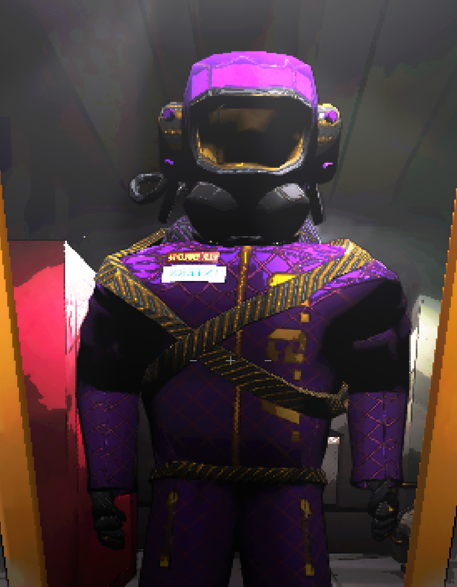

---

## Contents:

Package includes a set of Opulent Suits for the "Great Great Asset To The Company (TM)" and co.  

* Includes Red, Orange, Yellow, Green, Blue, Purple, Pink, Black, and White variations.

---

## Links:

For more recolors check here!  

* [CoffeesOpulentRecolors](https://thunderstore.io/c/lethal-company/p/Smartcoffee/CoffeesOpulentRecolors/)  

Anyone is free to use this as a base for recolors. Please let me know! I like seeing other people's work and I wanna put a link to you here!

---

## Credits:

* Software: [Adobe Substance 3D Painter](https://www.adobe.com/products/substance3d-painter.html)

* Base model and UV: [danisspars on Sketchfab](https://sketchfab.com/3d-models/lethal-company-scavenger-model-game-rip-dbcd1bbe54e7485fb13d86b4b5cbaf6b)

* Materials: [AmbientCG](https://ambientcg.com/)

---

## Changelog

1.0.0
* Release

1.1.0
* Cleaned up seams in the texture maps (as much as feasably possible)
* Added Red, Orange, Yellow, Green, Blue, Pink, Black, and White suit variations for a total of 9 colors!

1.1.1
* Renamed suits to reduce conflicts with recolors
* Added "Known Issues"
* Added links to other recolors (that I know of).
* Fixed alt text appearing in README page.

---

## Known Issues:  
Feel free to post any issues on the github page.  

* Color bleeding around the mask. Working to fix this.

---
